# GPIO_Designing
This repository contains the design basics of a GPIO.

# GPIO Cell Design
> A full-custom General Purpose Input/Output (GPIO) cell designed at the transistor level, featuring a transmitter path, receiver path, and pull-up/pull-down network. Designed and simulated using Cadence Virtuoso. The used PDK is Xfab-180.

---

## Table of Contents
- [Specifications](#specifications)
- [Architecture Overview](#architecture-overview)
- [Circuit Blocks](#circuit-blocks)
  - [Transmitter](#transmitter)
  - [Receiver](#receiver)
  - [PUPD Network](#pupd-network)
- [Sub-Blocks](#sub-blocks)
  - [Level Shifter](#level-shifter)
  - [Tri-State Machine](#tri-state-machine)
  - [P & N Driver](#p--n-driver)
  - [Schmitt Trigger](#schmitt-trigger)
  - [Inverter & Buffer](#inverter--buffer)
- [MOSFET Sizing](#mosfet-sizing)
- [Tuning Guide](#tuning-guide)
- [Simulation Results](#simulation-results)

---

## Specifications

| Parameter | Value | Unit |
|-----------|-------|------|
| Frequency | 50 | MHz |
| VDDIO | 5 | V |
| VDDC | 1.8 | V |
| VOH | > VDDIO − 0.2 | V |
| VOL | < 0.2 | V |
| IOH | 10 | mA |
| IOL | 10 | mA |
| Duty Cycle | 45 – 55 | % |
| Load Capacitance | 10 | pF |
| Core Capacitance | 0.1 | pF |
| VIH | 0.7 × VDDIO | V |
| VIL | 0.3 × VDDIO | V |
| VHYS | (0.1 – 0.3) × VDDIO | V |
| PU/PD Resistor | 10 | KΩ |

---

## Architecture Overview

The GPIO cell supports bidirectional data transfer between a digital core (operating at 1.8 V) and an external pad (operating at 5 V). 

**Figure 1: GPIO Circuit**

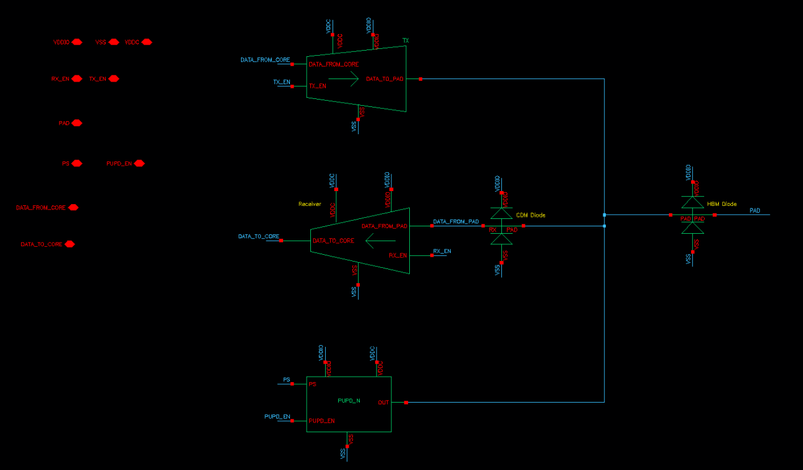

It consists of three primary functional paths:

- **Transmitter (TX):** Drives data from the core to the pad. Includes a level shifter, tri-state machine, and P/N driver.
- **Receiver (RX):** Receives data from the pad and passes it to the core. Uses a Schmitt trigger for noise immunity, followed by an inverter for level restoration.
- **PUPD Network:** Provides programmable pull-up and pull-down termination on the pad through a dedicated driver and 10 KΩ resistor network.

An HBM diode clamp is placed at the pad for ESD protection.

---

## Circuit Blocks

### Transmitter

**Figure 2: Transmitter Block**

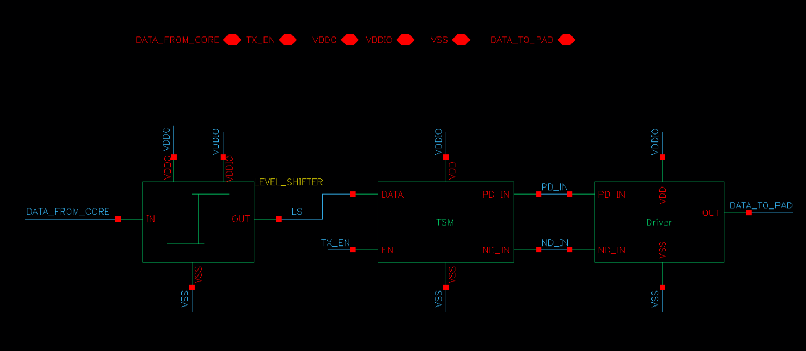

**Figure 3: Transmitter Block Output**

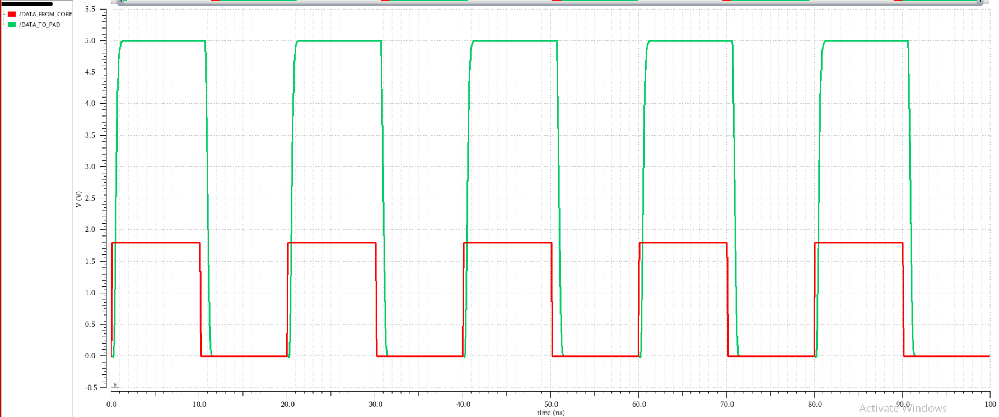

The transmitter path converts the 1.8 V core signal to a 5 V pad-compatible output. Data flows through:

1. **Level Shifter** — Translates the signal from VDDC (1.8 V) domain to the VDDIO (5 V) domain.
2. **Tri-State Machine (TSM)** — Generates the complementary `PD_IN` and `ND_IN` control signals for the driver, with tri-state capability via `TX_EN`.
3. **P & N Driver** — Final output stage with large PMOS and NMOS transistors sized to meet IOH/IOL and VOH/VOL requirements.

### Receiver

**Figure 4: Receiver Block**

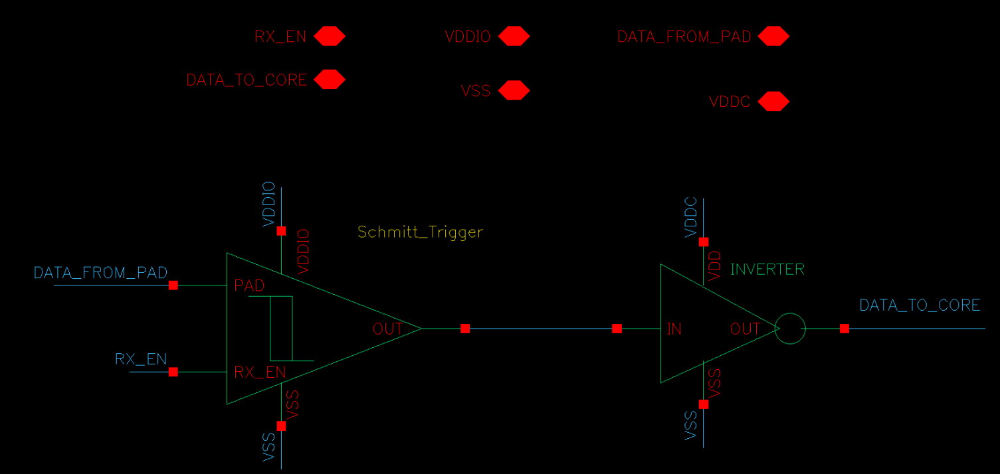

**Figure 5: Receiver Block Output**

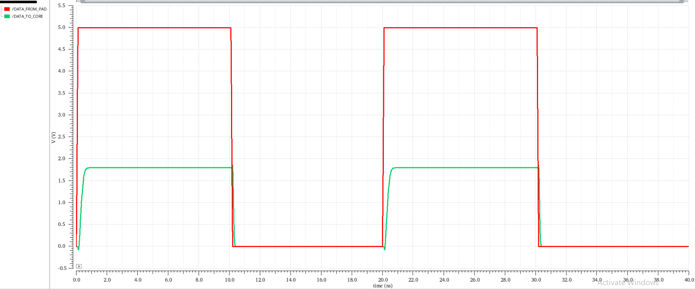

The receiver path accepts a 5 V pad signal and converts it to a clean 1.8 V core-level signal. Data flows through:

1. **Schmitt Trigger** — Powered by VDDIO; provides hysteresis to reject noise and glitches on the pad. Enable-controlled via `RX_EN`.
2. **Inverter** — Powered by VDDC; restores the logic level to the core domain and drives `DATA_TO_CORE`.

### PUPD Network

**Figure 6: PUPD Network**

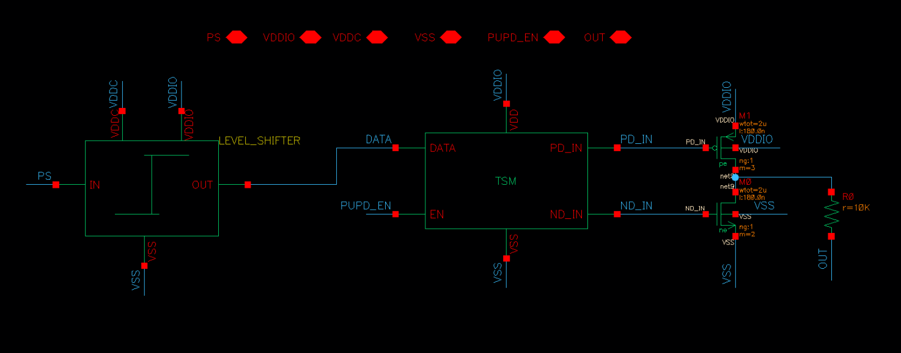

The pull-up/pull-down network is a standalone sub-circuit used to bias the pad to a defined logic level when no driver is active. It uses its own level shifter and tri-state machine to control a PMOS (pull-up) and NMOS (pull-down) through a 10 KΩ resistor, enabled via `PUPD_EN` and direction-controlled via `PS`.

---

## Sub-Blocks

### Level Shifter

**Figure 7: Level Shifter**

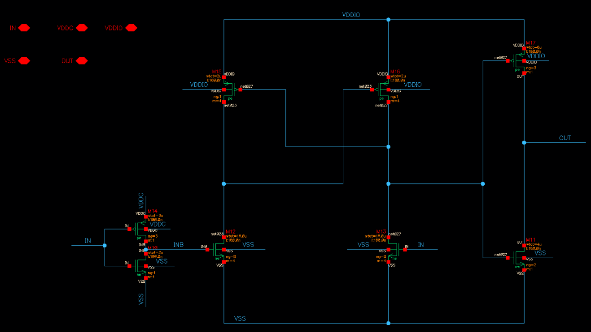

**Figure 8: Level Shifter Output**

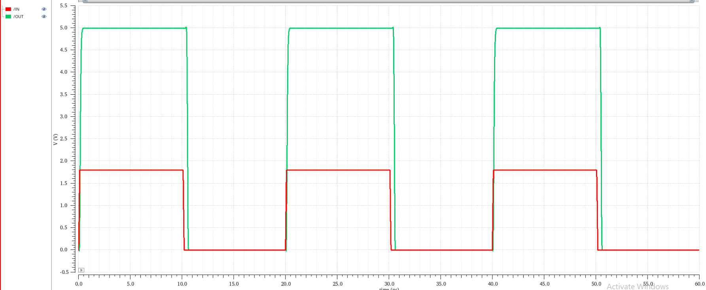

Converts a VDDC-domain input signal to a VDDIO-domain output. Uses a cross-coupled PMOS pair with NMOS inputs to perform the voltage translation. The circuit is designed to handle the full 1.8 V → 5 V swing reliably.

**Key signals:** `IN` (VDDC domain) → `OUT` (VDDIO domain)

### Tri-State Machine

**Figure 9: Tri-State Machine**

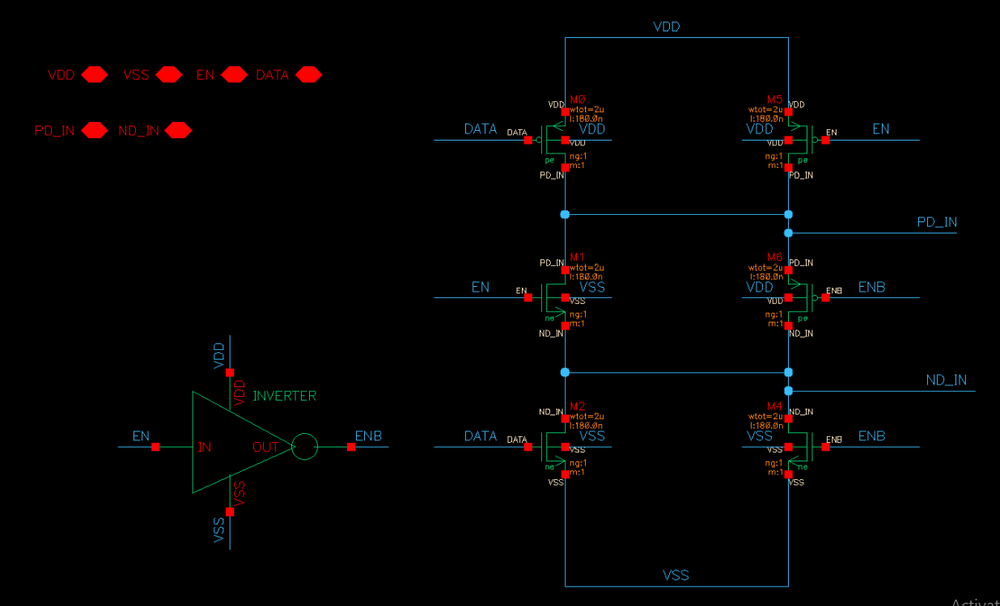

**Figure 10: Tri-State Machine Output**

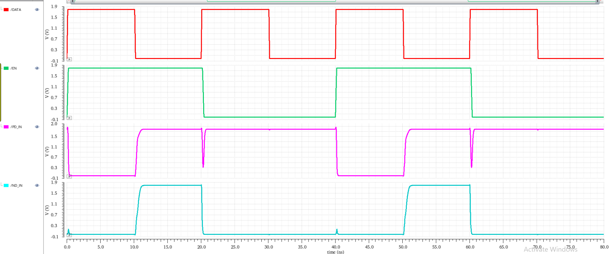

Decodes the `DATA` and `EN` signals to produce `PD_IN` and `ND_IN` for the driver stage, and `ENB` for disable control. When `EN` is low, both outputs are forced to a passive state, placing the driver in high-impedance (tri-state).

**Key signals:** `DATA`, `EN` → `PD_IN`, `ND_IN`, `ENB`

### P & N Driver

**Figure 11: P & N Driver**

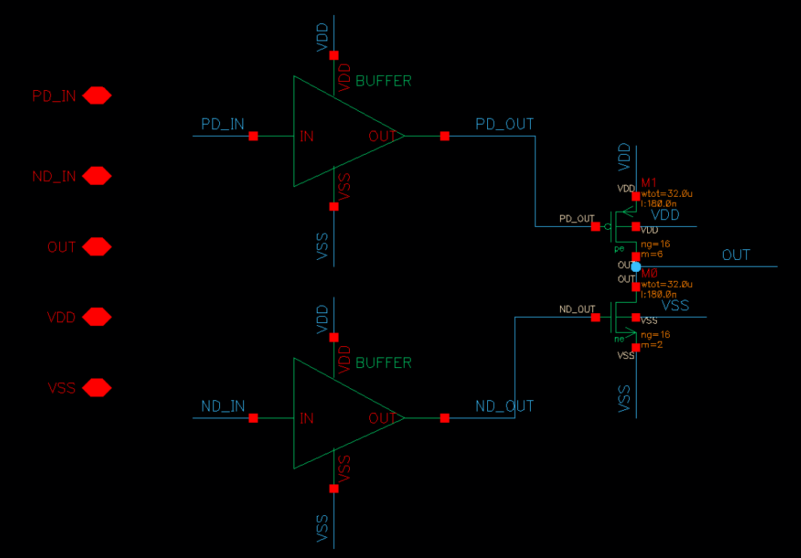

**Figure 12: P & N Driver Output**

A two-branch output driver consisting of:
- A **PMOS pull-up** (M1, wtot = 32 µm, L = 180 nm, m = 16) driven by `PD_OUT` through a buffer.
- An **NMOS pull-down** (M0, wtot = 32 µm, L = 180 nm, m = 16) driven by `ND_OUT` through a buffer.

Both branches are buffered independently to ensure fast switching and matched drive strengths.

### Schmitt Trigger

**Figure 13: Schmitt Trigger**

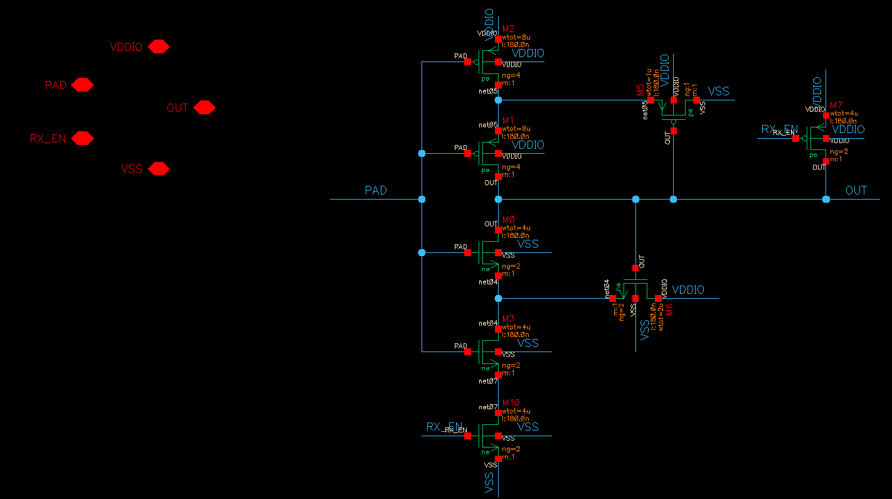

**Figure 14: Schmitt Trigger Output**

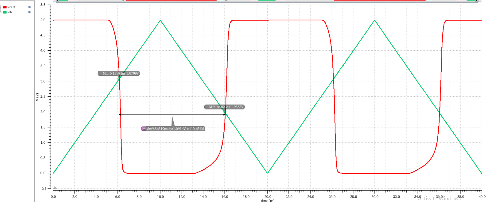

A hysteretic comparator operating in the VDDIO domain. Uses a standard Schmitt topology with feedback transistors to set VIH and VIL. The `RX_EN` signal gates the pull-down path, allowing the receiver to be disabled.

**Hysteresis window:** VHYS = (0.1 – 0.3) × VDDIO

### Inverter & Buffer

**Figure 15: Inverter Circuit**

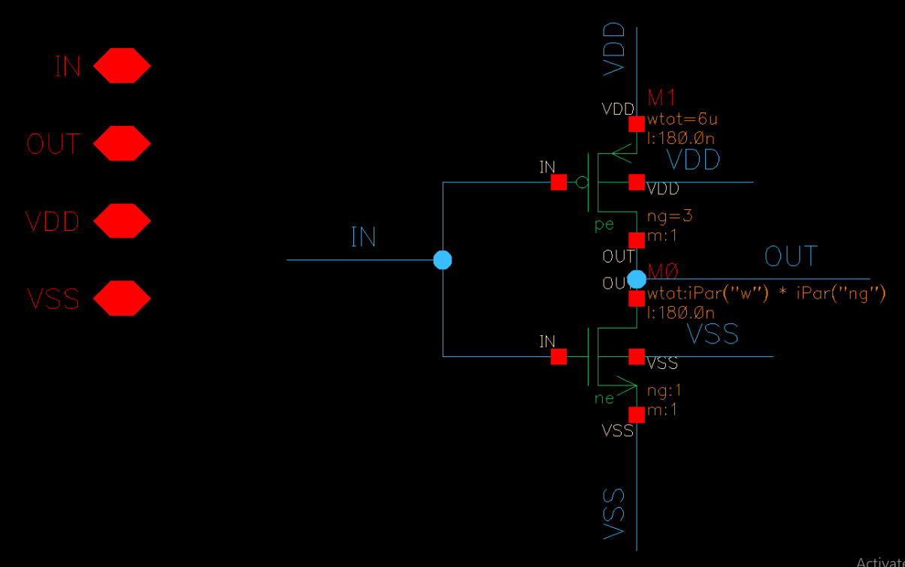

**Figure 16: Buffer Circuit**

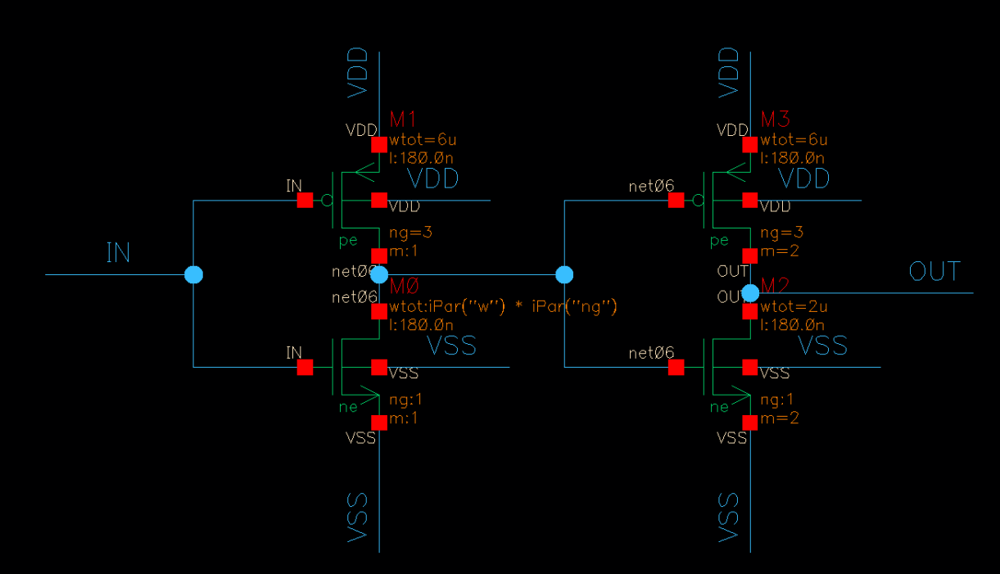

- **Inverter:** Standard CMOS inverter (PMOS: wtot = 6 µm, ng = 3, m = 1 | NMOS: parameterized). Used in the receiver output stage and inside the tri-state machine.
- **Buffer:** Two cascaded inverters with progressively larger NMOS (second stage: m = 2) to drive the output with sufficient current. Used inside the P & N Driver.

---

## MOSFET Sizing

| Block | Position | MOS | Multiplier (m) | Fingers (ng) |
|-------|----------|-----|----------------|--------------|
| Level Shifter | First & Last Inverter | PMOS | 1 | 3 |
| | Shifter | 1 | 4 |
| | First Inverter | NMOS | 1 | 1 |
| | Second Inverter | | 1 | 2 |
| | Shifter | | 8 | 4 |
| Tri-State Machine | All | All | 1 | 1 |
| P & N Driver | — | PMOS | 6 | 16 |
| | — | NMOS | 2 | 16 |
| Schmitt Trigger | Inverter | PMOS | 1 | 4 |
| | Switch | | 1 | 2 |
| | Feedback | | 1 | 1 |
| | Inverter | NMOS | 1 | 2 |
| | Switch | | 1 | 2 |
| | Feedback | | 1 | 2 |
| Inverter | — | PMOS | 1 | 3 |
| | — | NMOS | 1 | 1 |
| Buffer | First Inverter | PMOS | 1 | 3 |
| | Second Inverter | | 2 | 3 |
| | First Inverter | NMOS | 1 | 1 |
| | Second Inverter | | 2 | 1 |
| PUPD Network | Driver | PMOS | 3 | 1 |
| | | NMOS | 2 | 1 |

---

## Tuning Guide

The following MOSFET width adjustments can be used to tune key electrical parameters:

| Block | MOSFET | Effect of Increasing Width |
|-------|--------|---------------------------|
| P & N Driver | PMOS | IOH ↑ & VOH ↑ |
| P & N Driver | NMOS | IOL ↑ & VOL ↑ |
| Schmitt Trigger | First Inverter PMOS | VIH ↑ & VIL ↑ |
| Schmitt Trigger | First Inverter NMOS | VIH ↓ & VIL ↓ |
| Schmitt Trigger | Feedback PMOS | VIL ↓ & VHYS ↑↑ |
| Schmitt Trigger | Feedback NMOS | VIH ↑ & VHYS ↑↑ |

---

## Simulation Results

### Transmitter (TX) — Achieved Specs

| Parameter | Required Spec | Maximum | Minimum |
|-----------|---------------|---------|---------|
| VOL | < 0.2 V | 91.51 mV | 33.13 mV |
| VOH | > VDDIO − 0.2 V | VDDIO − 31.22 mV | VDDIO − 106.8 mV |
| IOL | > 10 mA | 43.63 mA | 19.43 mA |
| IOH | > 10 mA | 27.55 mA | 14.52 mA |
| Rise Time | — | 431.2 ps | 132 ps |
| Fall Time | — | 417.7 ps | 157.6 ps |
| Rising Delay | — | 643.7 ps | 2174 ps |
| Falling Delay | — | 1.15 ns | 347.6 ps |
| Period | 20 ns | 20 ns | 20 ns |
| Duty Cycle | 45% – 55% | 53.29% | 50.99% |

### Receiver (RX) — Achieved Specs

| Parameter | Required Spec | Maximum | Minimum |
|-----------|---------------|---------|---------|
| VIH | < 0.7 × VDDIO | 647.3 mV | 572.2 mV |
| VIL | > 0.3 × VDDIO | 484.3 mV | 401.9 mV |
| VHYS | 0.1 – 0.3 × VDDIO | 231.9 mV | 137.9 mV |
| Pulse Width | — | 10.06 ns | 9.872 ns |
| Period | 20 ns | 20 ns | 20 ns |
| Duty Cycle | 45% – 55% | 50.28% | 49.36% |

### PUPD Network — Achieved Specs

| Parameter | Required Spec | Maximum | Minimum |
|-----------|---------------|---------|---------|
| IOL | 18 µA – 22 µA | 19.56 µA | 17.22 µA |
| IOH | −18 µA – −22 µA | −19.29 µA | −19.86 µA |

> All specifications for TX and RX paths were met across process corners. PUPD network IOL slightly undershoots the 18 µA lower bound at the minimum corner, which may be addressed by adjusting the NMOS multiplier.
